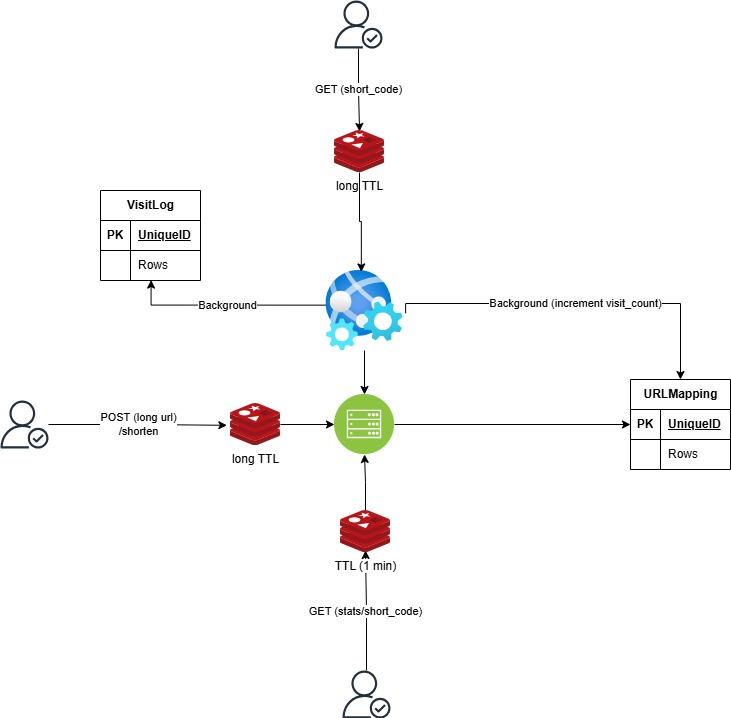

# URL Shortener Service



## System Design Overview

The URL Shortener service is built using a modern architecture with the following components:

1. **FastAPI Application Server**
   - Handles HTTP requests and responses
   - Implements URL shortening logic
   - Manages API endpoints
   - Built with Python and FastAPI framework

2. **PostgreSQL Database**
   - Stores URL mappings and visit statistics
   - Maintains data persistence
   - Handles concurrent requests efficiently

3. **Redis Cache**
   - Provides fast access to frequently accessed URLs
   - Reduces database load
   - Implements caching with TTL (Time To Live)
   - Improves response times for popular URLs

## Detailed System Design

### Components and Flow

1. **URL Creation Flow (POST /shorten)**
   - Client sends a POST request with the long URL
   - System checks Redis cache with long TTL for existing mapping
   - If not found, stores in PostgreSQL database (URLMapping table)
   - Caches the new mapping in Redis
   - Returns the generated short code to the client

2. **URL Redirection Flow (GET /{short_code})**
   - Client requests short URL redirection
   - System checks Redis cache with long TTL
   - If found, redirects immediately
   - If not found, queries PostgreSQL
   - Background tasks:
     - Increments visit count in URLMapping table
     - Creates visit log entry in VisitLog table

3. **Statistics Flow (GET /stats/{short_code})**
   - Client requests URL statistics
   - System checks Redis cache (1-minute TTL)
   - If not found, queries PostgreSQL
   - Returns visit count and other analytics
   - Caches results in Redis for 1 minute

### Database Schema

1. **URLMapping Table**
   - UniqueID
   - Rows containing URL mapping data
   - Visit count tracking

2. **VisitLog Table**
   - UniqueID
   - Rows containing visit data
   - Background logging system

### Caching Strategy

- **Multi-level Redis Caching**
  - Long TTL for URL mappings
  - Short TTL (1 minute) for statistics
  - Background updates for visit counts
  - Optimized for read-heavy operations

### Performance Optimizations

1. **Background Processing**
   - Asynchronous visit logging
   - Non-blocking visit count updates
   - Parallel database operations

2. **Cache Management**
   - Intelligent TTL settings
   - Cache warming for popular URLs
   - Distributed caching for scalability

## Project Description

This URL Shortener service provides a robust and scalable solution for creating short URLs from long ones. The service includes features like:

- URL shortening with custom short codes
- URL redirection with visit tracking
- Visit statistics and analytics
- Caching for improved performance

## Prerequisites

- Docker
- Docker Compose
- Git

## Getting Started

1. Clone the repository:
```bash
git clone <repository-url>
cd url-shortener
```

2. Create a `.env` file in the root directory with the following variables:
```env
ENV_SETTING=dev
PG_DSN=postgresql+asyncpg://debug:debug@db:5432/db
SHORT_CODE_LENGTH=5
REDIS_URL=redis
REDIS_PORT=6379
REDIS_DB_NUMBER=0
```

3. Run the application using Docker Compose:
```bash
docker-compose up --build
```

The application will be available at `http://localhost:8000`


## Docker Compose Services

The project uses Docker Compose to manage three main services:

1. **app**: The FastAPI application
   - Port: 8000
   - Depends on Redis and PostgreSQL
   - Includes database initialization script
   - Hot-reload enabled for development

2. **db**: PostgreSQL database
   - Port: 5432
   - Persistent volume for data storage
   - Environment variables for configuration

3. **redis**: Redis cache
   - Port: 6379
   - Used for caching and rate limiting

## Development

### Project Structure
```
url-shortener/
├── app/
│   ├── api/
│   ├── repositories/
│   ├── db/
│   ├── models/
│   ├── schemas/
│   ├── services/
│   ├── tasks/
│   ├── utils/
│   └── main.py
│   └── config.py
├── scripts/
│   └── init-db.sh
├── docker-compose.yml
├── Dockerfile
└── requirements.txt
```

## License

This project is licensed under the MIT License - see the LICENSE file for details.
